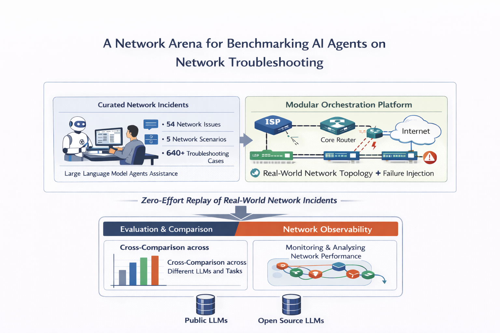

<div align="center">
<h1>A Network Arena for Benchmarking AI Agents on Network Troubleshooting</h1>

[🤖Overview](#🤖overview) | 
[📦Installation](#📦installation) | 
[🚀Quick Start](#🚀quick-start) | 
[🛠️Usage](#🛠️usage) | 
[📚Cite](#📚cite)

[](https://arxiv.org/abs/2512.16381)

</div>

<h1 id="🤖overview">🤖 Overview</h1>



This repository is a unified platform that can offer: 
1. A benchmark suite of curated network incidents that covers 56 realistic network issues, ranging from link and host failures to resource contention, and includes fourteen network scenarios (including Kubernetes labs), ten of which can be instantiated at different topology sizes, spanning campus, data center, and cloud-native networks. By combining these dimensions, the benchmark yields 685 distinct troubleshooting incidents for evaluating AI agents. Each incident specifies deterministic inject parameters (device names, etc.); IP and netmask values are derived from the live lab at inject time.
2. A modular plug-and-play orchestration platform that connects AI agents with the network environment, enabling real-time troubleshooting in realistic conditions, and providing a human-facing interface to monitor agent performance.


💡 **Note:** We are actively developing this framework. If you have any suggestions or are interested in contributing, feel free to reach out to us!

## Features

- Standardized network troubleshooting environment based on Kathará
- Unified `nika` CLI for env deploy, fault injection, agent runs, and evaluation
- Session-based workflow with multi-session support (`nika session`, `--session_id`)
- Parameterized fault injection (`nika failure describe`, `--set key=value`)
- MCP-based tool support
- Pre-built network scenarios and fault injection mechanisms
- Reproducible evaluation framework with batch summary (`nika eval summary`)
- Support for various network topologies and configurations
- Easy integration of custom AI agents
- Automatic evaluation mechanism

<h1 id="📦installation">📦 Installation</h1>

## Requirements

- [Kathará](https://www.kathara.org/). 
  Follow the [official installation guide](https://github.com/KatharaFramework/Kathara?tab=readme-ov-file#installation) to install Kathará.
- Python >= 3.12


## Setup

Clone the repository and install the dependencies. 
NIKA uses [uv](https://docs.astral.sh/uv) to manage the dependencies. Follow [uv installation instructions](https://docs.astral.sh/uv/getting-started/installation/) to install uv. You can also use a standard `pip install -e .` to install the dependencies.

```shell
# Clone the repository
git clone https://github.com/sands-lab/nika
cd nika

# Install dependencies
uv sync

# Activate the environment
source .venv/bin/activate
```

The Kathará API relies on Docker to function properly. We recommend to add current user to docker group to avoid calling with `sudo`. **However, please be aware of the security implications of this action.**

```shell
sudo usermod -aG docker $USER
```

Login again or activate temporaily with 

```shell
newgrp docker
```

<h1 id="🚀quick-start">🚀 Quick Start</h1>

## Configure environment variables

Copy the template and fill in values. **NIKA does not ship hard-coded agent defaults** — every `nika agent run` / `nika benchmark run` needs either a configured `.env` or explicit CLI flags.

```shell
cp .env.example .env
```

CLI flags override `.env` when both are set.

### Agent and judge settings

Shared flags (all agents): `-a` / `NIKA_AGENT_TYPE`, `-n` / `NIKA_MAX_STEPS`, `-m` / `NIKA_MODEL` (optional override). Per-agent env vars and examples are in **[Troubleshooting Agents](#troubleshooting-agents)**.

| Setting | `.env` variable | CLI flag |
|---------|-----------------|----------|
| Results parent dir | `NIKA_RESULT_DIR` | `--result_dir` on `nika env run`, `nika benchmark run` |
| Judge provider | `NIKA_JUDGE_PROVIDER` | `-p` on `nika eval judge` |
| Judge model | `NIKA_JUDGE_MODEL` | `-m` on `nika eval judge` |

API keys and observability: see [`.env.example`](.env.example).

## Step by step guide
You can follow the steps below to run a complete troubleshooting task with NIKA. Use the `nika` CLI.

Each `nika env run` creates a **session** (printed as `session_id=…`). Session state lives under `runtime/sessions/` and tracks the deployed lab, injected failures, and agent activity. When only one session is running, most commands auto-select it; pass `--session_id` when several sessions are active.

1. **List scenarios and start the network environment**

   ```shell
   nika env list
   nika env run <scenario>                    # scenarios without topology sizes (e.g. simple_bgp)
   nika env run <scenario> -s s             # scalable scenarios (size: s, m, or l)
   nika env ps                                # running lab instances (grouped by deployed env)
   ```

2. **Inspect and manage sessions**

   ```shell
   nika session ps                            # running sessions (status, failures, agents)
   nika session ps -a                         # include finished sessions
   nika session inspect [--session_id ID]       # full session JSON + failure summary
   nika session inspect -c                    # also list lab containers (docker-ps style)
   nika session containers [--session_id ID]  # list containers in the session lab
   nika session close [--session_id ID]       # undeploy lab and clear runtime state
   nika session wipe -y                       # close every running session and wipe Kathara
   ```

3. **List problems and inject faults**

   ```shell
   nika failure list
   nika failure describe <problem_id>         # required parameter schema
   nika failure inject <problem_id> --set host_name=pc1 --set intf_name=eth0
   nika failure ps [--session_id ID]          # persisted injection records
   ```

4. **Run commands inside a lab host** (optional debugging)

   ```shell
   nika exec pc1 ip addr show
   nika exec pc1 ping -c 3 10.0.0.2 --timeout 30
   ```

5. **List agent options and run the agent**

   ```shell
   nika agent list
   nika agent run -a byo.langgraph -p openai -m gpt-5-mini -n 20
   nika agent run -a byo.mcp_agent -m gpt-4.1-mini -n 20
   nika agent run -a byo.autogen -m gpt-4.1-mini -n 20
   nika agent run -a local_cli.codex_cli -m gpt-5.4-mini
   nika agent run -a local_cli.claude_cli
   nika agent run -a community.sade -n 20
   ```

   See **[Troubleshooting Agents](#troubleshooting-agents)** for per-agent configuration.

6. **Close the session, then evaluate the run** (metrics, judge, and CSV summary are separate steps)

   ```shell
   nika session close [--session_id ID] -y    # undeploy lab and clear runtime state first
   nika eval metrics
   nika eval judge -p openai -m gpt-5-mini
   nika eval summary                              # all finished sessions → default CSV
   nika eval summary -p link_down -e simple_bgp   # filter by problem and scenario
   nika eval summary -o results/0_summary/my_run.csv
   nika eval clean -y                              # wipe results/, session JSON, and SQLite index
   ```

Full CLI documentation (benchmark batch mode, traffic types, parameter tables, and conventions) lives in **[src/nika/cli/README.md](src/nika/cli/README.md)**. Developer guides: **[Creating Benchmark Tasks](docs/creating-benchmark-tasks.md)**, **[Custom Agents](docs/custom-agents.md)**, and **[Agent Skills](docs/agent-skills.md)**.

### Optional: benchmark or traffic from the CLI

```shell
nika benchmark run
nika benchmark run dc_clos_bgp --problem bgp_asn_misconfig -s s
nika benchmark run --result_dir results/list1              
nika benchmark run --result_dir results/list1 --batch-size 4
nika benchmark run --judge --judge-provider openai --judge-model gpt-5-mini
nika traffic list
nika traffic run od --all-to-host pc1 --mbps 20 --interval 300 --background
```

## Run Unit Tests

```shell
# run all unit tests
uv run --with pytest pytest

# verbose output
uv run --with pytest pytest -v

# run only selected test files
uv run --with pytest pytest tests/test_session.py -v
```

<h1 id="🛠️usage">🛠️ Usage</h1>

## Troubleshooting Agents

Agent implementations live under [`src/agent/`](src/agent/). All agents share the same contract (`async run(task_description) -> dict`), the same two-phase pipeline (**diagnosis** → **submission**), and write `results/{session_id}/messages.jsonl` plus `submission.json`. Extension details: **[Custom Agents](docs/custom-agents.md)** and **[src/agent/README.md](src/agent/README.md)**.

### Layout

```
src/agent/
├── byo/                  # Bring-your-own LLM / agent framework
│   ├── langgraph/        # -a byo.langgraph
│   ├── mcp_agent/        # -a byo.mcp_agent
│   └── autogen/          # -a byo.autogen
├── local_cli/            # Local CLI subprocess workers
│   ├── codex_cli/        # -a local_cli.codex_cli
│   └── claude_cli/       # -a local_cli.claude_cli
├── community/            # Community-contributed agents
│   └── sade/             # -a community.sade
└── sdk/                  # SDK agents
    ├── claude_sdk/       # -a sdk.claude_sdk
    └── codex_sdk/        # -a sdk.codex_sdk
```

| CLI name | Package | Orchestration | LLM access |
| -------- | ------- | ------------- | ---------- |
| `byo.langgraph` | `byo/langgraph` | LangGraph `StateGraph` | LangChain ReAct + `load_model()` |
| `byo.mcp_agent` | `byo/mcp_agent` | mcp-agent `Workflow` | [mcp-agent SDK](https://docs.mcp-agent.com/mcp-agent-sdk/overview) + OpenAI |
| `byo.autogen` | `byo/autogen` | AutoGen `GraphFlow` | [AutoGen AgentChat](https://microsoft.github.io/autogen/stable/) + OpenAI |
| `local_cli.codex_cli` | `local_cli/codex_cli` | LangGraph `StateGraph` | `codex exec` subprocess + shared skills |
| `local_cli.claude_cli` | `local_cli/claude_cli` | LangGraph `StateGraph` | `claude -p` subprocess + shared skills |
| `community.sade` | `community/sade` | Single Claude Code session + skill library | `claude-agent-sdk` (optional extra `sade`) |
| `sdk.claude_sdk` | `sdk/claude_sdk` | Native two-phase `ClaudeSDKClient` | `claude-agent-sdk` + shared skills (optional extra `sdk`) |
| `sdk.codex_sdk` | `sdk/codex_sdk` | Native two-phase `AsyncCodex` | `openai-codex` + shared skills (optional extra `sdk`) |

### Shared configuration

| Flag | Env | Notes |
|------|-----|-------|
| `-a` / `--agent` | `NIKA_AGENT_TYPE` | Required |
| `-n` / `--max-steps` | `NIKA_MAX_STEPS` | Per-phase step limit (`byo.langgraph`, `byo.mcp_agent`, `byo.autogen`, `community.sade`) |
| `-m` / `--model` | `NIKA_MODEL` | Overrides agent-specific model env when set |
| `--session_id` | — | Target session (default: current running session) |

Model resolution: `-m` → `NIKA_MODEL` → agent-specific env (below).

### Agent skills

Claude Code and Codex agents load reusable skill libraries during diagnosis when `NIKA_ENABLE_SKILLS=true` (default). The shared library lives under [`src/agent/skills/`](src/agent/skills/). Override with `NIKA_SKILLS_DIR`.

- **Claude agents** (`local_cli.claude_cli`, `sdk.claude_sdk`): native `Skill(skill="...")` tool + `.claude/skills/`
- **Codex agents** (`local_cli.codex_cli`, `sdk.codex_sdk`): `.agents/skills/` + workspace `AGENTS.md`
- **SADE** (`community.sade`): separate 15-skill library under `src/agent/community/sade/.claude/`

Authoring guide: **[docs/agent-skills.md](docs/agent-skills.md)**.

### `byo.langgraph` (`byo/langgraph`)

LangGraph + LangChain ReAct workers per phase. Requires `-p` / `NIKA_LLM_PROVIDER` (`openai`, `deepseek`, `ollama`).

| Provider | Credential |
|----------|------------|
| `openai` | `OPENAI_API_KEY` |
| `deepseek` | `DEEPSEEK_API_KEY` |
| `ollama` | `OLLAMA_API_URL` (default `http://localhost:11434`) |

| Env | Default |
|-----|---------|
| `NIKA_LANGGRAPH_MODEL` | `gpt-5-mini` |

```shell
nika agent run -a byo.langgraph -p openai -m gpt-5-mini -n 20
nika agent run -a byo.langgraph -p ollama -m qwen2.5:7b -n 20
```

Observability: LangSmith (`byo.langgraph`, `local_cli.codex_cli`, `local_cli.claude_cli`); Langfuse (`byo.langgraph` only). See `.env.example`.

### `byo.mcp_agent` (`byo/mcp_agent`)

[mcp-agent SDK](https://docs.mcp-agent.com/mcp-agent-sdk/overview) workers per phase. Orchestration uses mcp-agent ``Workflow``.

| Env | Default |
|-----|---------|
| `NIKA_MCP_AGENT_MODEL` | `gpt-4.1-mini` |

```shell
nika agent run -a byo.mcp_agent -m gpt-4.1-mini -n 20
```

### `byo.autogen` (`byo/autogen`)

[AutoGen AgentChat](https://microsoft.github.io/autogen/stable/) ``GraphFlow`` workers per phase. Each phase uses an `AssistantAgent` with MCP tools from the same Kathara / task MCP servers as other agents.

| Env | Default |
|-----|---------|
| `NIKA_AUTOGEN_MODEL` | `gpt-4.1-mini` |

```shell
nika agent run -a byo.autogen -m gpt-4.1-mini -n 20
```

### `local_cli.codex_cli` (`local_cli/codex_cli`)

Requires [Codex CLI](https://developers.openai.com/codex) on `PATH`; auth via `codex login` or `OPENAI_API_KEY`. Workspace: `{result_dir}/{session_id}/codex_workspace/`. Loads shared skills from `src/agent/skills/` when `NIKA_ENABLE_SKILLS=true`.

| Flag | Env | Notes |
|------|-----|-------|
| `-m` / `--model` | `NIKA_CODEX_MODEL` | Default `gpt-5.4-mini` |
| `-e` / `--reasoning-effort` | `NIKA_CODEX_REASONING_EFFORT` | `none`, `minimal`, `low`, `medium`, `high`, `xhigh` |

```shell
codex login
nika agent run -a local_cli.codex_cli -m gpt-5.4-mini -e medium
```

### `local_cli.claude_cli` (`local_cli/claude_cli`)

Requires [Claude Code](https://docs.anthropic.com/en/docs/claude-code) on `PATH`. Workspace: `{result_dir}/{session_id}/claude_workspace/`. Loads shared skills via `--setting-sources project` when `NIKA_ENABLE_SKILLS=true`.

Auth (pick one): `ANTHROPIC_API_KEY`, `ANTHROPIC_BASE_URL` + `ANTHROPIC_AUTH_TOKEN`, or `claude auth login`.

Model when `-m` omitted (first non-empty): `ANTHROPIC_MODEL` → `CLAUDE_CODE_SUBAGENT_MODEL` → `ANTHROPIC_DEFAULT_SONNET_MODEL`.

```shell
nika agent run -a local_cli.claude_cli
nika agent run -a local_cli.claude_cli -m deepseek-v4-flash
```

### `sdk.claude_sdk` (`sdk/claude_sdk`)

Native two-phase pipeline via `claude-agent-sdk` `ClaudeSDKClient` sessions (no LangGraph). Requires `uv sync --extra sdk --prerelease=allow`. Loads shared skills when `NIKA_ENABLE_SKILLS=true`.

Auth: DeepSeek or Anthropic via `ANTHROPIC_BASE_URL` + `ANTHROPIC_AUTH_TOKEN` (same as `local_cli.claude_cli`).

| Flag | Env | Notes |
|------|-----|-------|
| `-n` / `--max-steps` | `NIKA_MAX_STEPS` | SDK `max_turns` per phase |
| `-m` / `--model` | `NIKA_CLAUDE_SDK_MODEL` or `ANTHROPIC_MODEL` chain | |

```shell
nika agent run -a sdk.claude_sdk -n 20
nika agent run -a sdk.claude_sdk -m deepseek-v4-flash
```

### `sdk.codex_sdk` (`sdk/codex_sdk`)

Native two-phase pipeline via `openai-codex` `AsyncCodex` threads. Requires `uv sync --extra sdk --prerelease=allow`. Loads shared skills when `NIKA_ENABLE_SKILLS=true`.

Auth: local only — `codex login` → `~/.codex/auth.json`.

| Flag | Env | Notes |
|------|-----|-------|
| `-m` / `--model` | `NIKA_CODEX_SDK_MODEL` or `NIKA_CODEX_MODEL` | Default `gpt-5.4-mini` |
| `-e` / `--reasoning-effort` | `NIKA_CODEX_REASONING_EFFORT` | Same as `local_cli.codex_cli` |

```shell
codex login
nika agent run -a sdk.codex_sdk -m gpt-5.4-mini -e medium
```

### `community.sade` (`community/sade`)

Single Claude Code session with SADE's phase-gated prompt and a **15-skill fault-family library** under `src/agent/community/sade/.claude/`. Requires `uv sync --extra sade`. Auth same as `local_cli.claude_cli` (env API only).

| Env | Notes |
|-----|-------|
| `NIKA_SADE_MODEL` | Optional model override |
| `ANTHROPIC_MODEL` chain | Same as `local_cli.claude_cli` |

```shell
nika agent run -a community.sade -n 20
```

See [`src/agent/community/sade/README.md`](src/agent/community/sade/README.md) and the [SADE paper](https://arxiv.org/abs/2605.04530).

### Example: `simple_bgp` with `link_down`

End-to-end workflow from lab deploy through agent run and evaluation:

```shell
# 1. Deploy the network environment (creates a session)
nika env list
nika env run simple_bgp
# → prints session_id=20260613-061340-072e35

# 2. Inspect the fault schema, then inject a link-down on pc1
nika failure describe link_down
nika failure inject link_down --set host_name=pc1 --set intf_name=eth0

# 3. (optional) verify the fault from inside the lab
nika exec pc1 ip link show eth0
nika exec pc2 ping -c 3 195.11.14.2

# 4. Run a troubleshooting agent on the session task
nika agent run -a byo.langgraph -p openai -m gpt-5-mini -n 20
# nika agent run -a byo.mcp_agent -m gpt-4.1-mini -n 20
# nika agent run -a byo.autogen -m gpt-4.1-mini -n 20
# nika agent run -a local_cli.codex_cli -m gpt-5.4-mini

# 5. Inspect session state and artifacts
nika session inspect
ls {result_dir}/{session_id}/
# run.json, ground_truth.json, events.jsonl, messages.jsonl, submission.json, codex_workspace/ (cli only)

# 6. Close the lab, then evaluate
nika session close -y
nika eval metrics
nika eval judge -p openai -m gpt-5-mini
```

When multiple sessions are running, pass `--session_id <id>` to `failure inject`, `agent run`, and other session-scoped commands.

## Network Scenarios

Registered scenarios (see `nika env list`) live under `src/nika/net_env/`:

| Scenario ID | Scalable | Description |
| ----------- | -------- | ----------- |
| `dc_clos_bgp` | ✓ | Multi-tier data center CLOS with EBGP (FRR). |
| `dc_clos_service` | ✓ | Data center CLOS with DNS/HTTP edge services and external clients. |
| `ospf_enterprise_static` | ✓ | Enterprise hierarchical OSPF network with static host addressing. |
| `ospf_enterprise_dhcp` | ✓ | Enterprise OSPF network with DHCP for host addressing. |
| `rip_small_internet_vpn` | ✓ | Small RIP-based Internet with external zones and WireGuard VPN overlay. |
| `sdn_clos` | ✓ | Scalable SDN spine–leaf fabric with OpenFlow controller. |
| `sdn_star` | ✓ | SDN star (hub-and-spoke) topology with OpenFlow controller. |
| `simple_bgp` | -- | Compact inter-domain BGP lab (two routers, two hosts). |
| `p4_int` | -- | P4 spine–leaf testbed with In-band Network Telemetry (InfluxDB). |
| `p4_bloom_filter` | -- | P4 bloom-filter data-plane validation testbed. |
| `p4_counter` | -- | P4 counter pipeline testbed. |
| `p4_mpls` | -- | P4 MPLS data-plane testbed. |
| `k8s_lab` | -- | Fat-tree BGP fabric with k3s cluster, MetalLB, NGINX Ingress, and sample microservices. See [k8s_lab README](src/nika/net_env/kubernetes/k8s_lab/README.md). |
| `llmd_lab` | -- | Star topology with k3s cluster running llm-d disaggregated Prefill/Decode inference (simulated, no GPU). See [llmd_lab README](src/nika/net_env/kubernetes/llmd_lab/README.md). |

Each scenario is defined in a Kathará `lab.py` file, which specifies the network topology, devices, and initial configurations. See **[Creating Benchmark Tasks](docs/creating-benchmark-tasks.md)** for the NIKA extension workflow, and check [Kathará API Docs](https://github.com/KatharaFramework/Kathara/wiki/Kathara-API-Docs) for Kathará details.

## Network issues

This framework provides a set of predefined issues that can be injected into the network environment. These issues are categorized into different types, each with specific root causes and key signals. By combining the issues with the network scenarios and composing multiple issues, this framework can generate multiple incidents based on a network issue (see # Incident column). Inject parameters must be specified explicitly (see `nika failure describe`); network addresses are read from the target host at inject time.
The following table summarizes the issues available in this framework:

| Category                               | Root Cause                              | Key Signals                                                     | # Incident |
| -------------------------------------- | --------------------------------------- | --------------------------------------------------------------- | ---------- |
| Link failures                          | Link flap                               | Flap event logs; packet drops                                   | 26         |
| Link failures                          | Link detached                           | Physical link not detected; PHY down                            | 26         |
| Link failures                          | Link down                               | Interface state down                                            | 26         |
| Link failures                          | Faulty cable                            | CRC errors; corrupted frames                                    | 26         |
| Link failures                          | MAC address conflict                    | Same MAC seen on multiple ports; MAC flapping logs              | 26         |
| Link failures                          | Link fragmentation disabled             | Large packets dropped; MTU mismatch                             | 26         |
| End-host failures                      | Conflicting VPN memberships             | Overlapping subnets; VPN servers unreachable                    | 3          |
| End-host failures                      | Host crash                              | Host unresponsive; no heartbeat; ping fails                     | 35         |
| End-host failures                      | Host IP conflict                        | Duplicate IP alerts; ARP conflict detected                      | 26         |
| End-host failures                      | Host IP misconfig                       | Incorrect or missing IP address; host unresponsive              | 68         |
| End-host failures                      | Incorrect netmask                       | Partial reachability; inconsistent routing behavior             | 16         |
| End-host failures                      | DNS empty answer                        | Incorrect or missing DNS records; NXDOMAIN                      | 6          |
| Network node errors                    | Number of MPLS labels hit limit         | Error logs; packet drops                                        | 1          |
| Network node errors                    | Switch/router crash (e.g., overheating) | Switch down and unreachable from MGMT                           | 20         |
| Network node errors                    | P4 program reads `invalid` header field | Packet drops; error logs (platform-dependent)                   | 8          |
| Network node errors                    | SDN controller crash                    | Switches isolated; new flows dropped                            | 6          |
| Network node errors                    | Southbound port unreachable             | OpenFlow/TCP 6633/6653 unreachable                              | 12         |
| Misconfigurations (routing, ACL, etc.) | BGP ASN mismatch                        | BGP session fails; ASN mismatch detected                        | 7          |
| Misconfigurations (routing, ACL, etc.) | BGP blackhole route leak                | Traffic to specific prefixes blackholed; unexpected AS path     | 7          |
| Misconfigurations (routing, ACL, etc.) | Missing BGP advertisement               | Prefix not propagated; missing announcements                    | 7          |
| Misconfigurations (routing, ACL, etc.) | Host static blackhole                   | Static blackhole route active; traffic dropped                  | 7          |
| Misconfigurations (routing, ACL, etc.) | OSPF area misconfiguration              | OSPF adjacency failure; area mismatch                           | 6          |
| Misconfigurations (routing, ACL, etc.) | OSPF neighbor missing                   | Missing neighbor; no Hello packets exchanged                    | 6          |
| Misconfigurations (routing, ACL, etc.) | Forwarding table entry misconfig        | No matching entry; default drop                                 | 8          |
| Misconfigurations (routing, ACL, etc.) | Flow rule loop                          | Traffic loop observed; CPU spike; port flooding                 | 6          |
| Misconfigurations (routing, ACL, etc.) | Flow rule shadowing                     | Lower-priority rule overridden by higher-priority rule          | 6          |
| Misconfigurations (routing, ACL, etc.) | ARP ACL block                           | ARP requests or replies dropped; ACL deny counters increase     | 26         |
| Misconfigurations (routing, ACL, etc.) | ICMP ACL block                          | ICMP traffic blocked; ping fails                                | 26         |
| Misconfigurations (routing, ACL, etc.) | Routing control-plane ACL block         | BGP (TCP/179) or OSPF (IP proto 89) blocked; neighborship fails | 13         |
| Misconfigurations (routing, ACL, etc.) | HTTP ACL block                          | HTTP 80/443 traffic blocked; client connection timeout          | 12         |
| Resource contention                    | Microbursts on interface                | Reduced throughput; queue buildup                               | 26         |
| Resource contention                    | Receiver saturated & slow               | Multiple segments ACKed per ACK; RWND < CWND                    | 12         |
| Resource contention                    | Incast traffic                          | Queue buildup; packet drops; retransmissions                    | 12         |
| Resource contention                    | Sender saturated & slow                 | Segments smaller than MSS; Flight size < min(CWND,RWND)         | 24         |
| Resource contention                    | Software middle-box overloads           | CPU usage saturates; queue buildup; RTT increases               | 3          |
| Network under attack                   | Service DoS                             | Surge in HTTP connections; CPU/RAM usage spikes                 | 18         |
| Network under attack                   | BGP hijacking                           | More specific or illegitimate prefixes appear; path anomaly     | 3          |
| Network under attack                   | DHCP spoofing                           | DHCP clients received spoofed configurations (IP, DNS, etc.)    | 9          |
| Network under attack                   | DNS spoofing                            | DNS points to wrong addresses                                   | 12         |
| Network under attack                   | ARP cache poisoning                     | Abnormal traffic redirection                                    | 26         |
| Network under attack                   | Misaligned sketch thresholds            | False-positive cardinality alerts (e.g., DoS); packet drops     | 1          |
| **Total**                              | -                                       | -                                                               | **685**    |

Based on the above issues, we disclose a large public dataset of AI agents’ behavior for network troubleshooting, with more than 900 reasoning traces. See the [](https://zenodo.org/records/17971675).

## MCP Servers and Tools

This framework provides MCP servers under `src/nika/service/mcp_server`. These include:

- **Kathará base MCP server** (`kathara_base_mcp_server.py`): host reachability and diagnostics, including
  - `get_reachability` to ping all pairs of hosts (subset when the lab is large).
  - `ping_pair` to ping between two specific hosts.
  - `iperf_test` to run an iperf test between two hosts.
  - `systemctl_ops` to manage system services (start, stop, restart, status).
  - `get_host_net_config` to retrieve the network configuration of a host.
  - `get_tc_statistics`, `netstat`, `ip_addr_statistics`, `ethtool`, `curl_web_test` for interface and service checks.
  - `cat_file`, `exec_shell`, `exec_shell_dual` to read files or run commands in containers.
- **BMv2 MCP server** (`kathara_bmv2_mcp_server.py`): P4/BMv2 switch interaction, including
  - `bmv2_get_log`, `bmv2_get_counter_arrays`, `bmv2_read_p4_program`, `bmv2_counter_read`.
  - `bmv2_show_tables`, `bmv2_table_dump`, `bmv2_get_register_arrays`, `bmv2_register_read`.
- **FRR MCP server** (`kathara_frr_mcp_server.py`): FRRouting routers, including
  - `frr_get_bgp_conf`, `frr_get_ospf_conf`, `frr_show_running_config`, `frr_show_ip_route`, `frr_exec`.
- **Telemetry MCP server** (`kathara_telemetry_mcp_server.py`): INT/InfluxDB telemetry, including
  - `influx_list_buckets`, `influx_get_measurements`, `influx_count_measurements`, `influx_query_measurement`.
- **Task management MCP server** (`task_mcp_server.py`): agent submissions, including
  - `list_avail_problems` to list injectable root-cause ids.
  - `submit` to write the agent's final detection/localization/RCA answer.

💡 More tools are coming soon...

You can also plug in your own MCP servers following the configuration instruction. Look for more MCP servers at [mcp.so](https://mcp.so/).


## Logging and Observability

Each session directory under `{result_dir}/{session_id}/` (default `{result_dir}` = `results/`) contains:

- **`events.jsonl`**: pipeline events (env deploy, fault inject, agent start/end, eval).
- **`messages.jsonl`**: agent conversation and tool traces.

LangSmith / Langfuse keys: `.env.example`. Custom loggers: `src/agent/utils/loggers.py` and **[src/agent/README.md](src/agent/README.md)**.

<h1 id="📚cite">📚 Cite</h1>

```bibtex
@misc{nika,
      title={A Network Arena for Benchmarking AI Agents on Network Troubleshooting}, 
      author={Zhihao Wang and Alessandro Cornacchia and Alessio Sacco and Franco Galante and Marco Canini and Dingde Jiang},
      year={2025},
      eprint={2512.16381},
      archivePrefix={arXiv},
      primaryClass={cs.NI},
      url={https://arxiv.org/abs/2512.16381}, 
}
```

```bibtex
@inproceedings{llm4netlab,
author = {Wang, Zhihao and Cornacchia, Alessandro and Galante, Franco and Centofanti, Carlo and Sacco, Alessio and Jiang, Dingde},
title = {Towards a Playground to Democratize Experimentation and Benchmarking of AI Agents for Network Troubleshooting},
year = {2025},
isbn = {9798400720871},
publisher = {Association for Computing Machinery},
address = {New York, NY, USA},
url = {https://doi.org/10.1145/3748496.3748990},
doi = {10.1145/3748496.3748990},
booktitle = {Proceedings of the 1st Workshop on Next-Generation Network Observability},
pages = {1–3},
numpages = {3},
location = {Coimbra, Portugal},
series = {NGNO '25}
}
```

# Acknowledgement

This project is largely motivated by [AIOpsLab](https://github.com/microsoft/AIOpsLab). We sincerely thank the authors for their excellent work.

# Licence

Licensed under the MIT license.