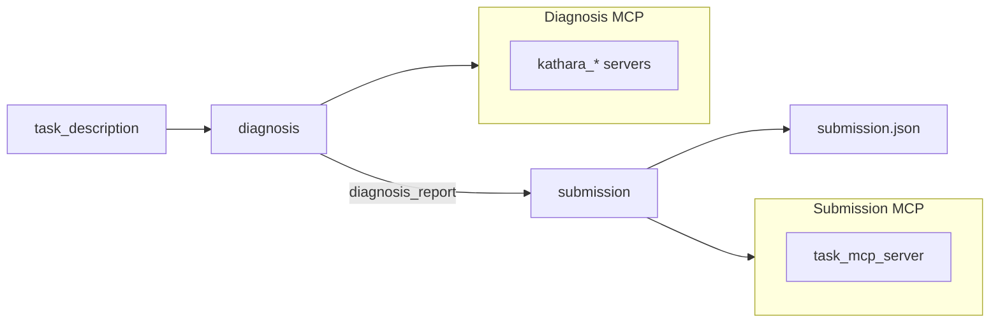

# Agent Architecture

`src/agent` hosts multiple troubleshooting agent implementations for NIKA. All implementations share the same entry contract (`protocols.TroubleshootingAgent`) and produce the same session artifacts (`messages.jsonl`, `submission.json`, etc.).

## Directory Layout

```
src/agent/
├── protocols.py          # Shared Protocol interface
├── registry.py           # Type registry and factory for `nika agent run`
├── langgraph/            # [implemented] LangGraph + LangChain ReAct
│   ├── react_agent.py    # StateGraph orchestration: diagnosis → submission
│   └── phases/           # LangChain create_agent workers per pipeline phase
├── mock/                 # [implemented] Deterministic mock without an LLM
│   └── mock_agent.py
├── sdk/                  # [planned] Direct Claude / Codex SDK integration
│   └── agent.py
├── codex_cli/            # [implemented] LangGraph + Codex CLI
│   ├── agent.py          # CodexCliAgent — StateGraph orchestrator
│   ├── codex_worker.py   # CodexWorker — codex exec subprocess adapter
│   ├── codex_display.py  # Terminal formatting for codex --json events
│   └── phases/           # Codex CLI workers per pipeline phase
├── claude_cli/           # [implemented] LangGraph + Claude Code CLI
│   ├── agent.py          # ClaudeAgent — StateGraph orchestrator
│   ├── config.py         # Model defaults and auth from environment
│   ├── claude_worker.py  # ClaudeWorker — claude -p subprocess adapter
│   ├── claude_display.py # Terminal formatting for stream-json events
│   └── phases/           # Claude CLI workers per pipeline phase
├── llm/                  # LangChain model factory for the LangGraph path
│   └── model_factory.py
└── utils/                # Shared utilities across implementations
    ├── mcp_servers.py    # Kathara / task MCP configuration
    ├── phases.py         # Pipeline phase identifiers (diagnosis / submission)
    └── loggers.py        # Structured logging to messages.jsonl
```

## Implementation Paths

| Type | CLI name | Orchestration | LLM access | Status |
|------|----------|---------------|------------|--------|
| LangGraph | `react` | LangGraph `StateGraph` | LangChain ReAct + `load_model()` | Implemented |
| Mock | `mock` | Hand-written two-phase flow | No LLM; fixed tool sequence | Implemented |
| Codex SDK | `codex_sdk` | TBD (recommended: same two phases) | Cursor SDK / Codex SDK | Planned |
| Claude SDK | `claude_sdk` | TBD (recommended: same two phases) | Anthropic SDK | Planned |
| Codex CLI | `codex_cli` | LangGraph `StateGraph` | `codex exec` subprocess | Implemented |
| Claude CLI | `claude_cli` | LangGraph `StateGraph` | `claude -p` subprocess | Implemented |

## Shared Two-Phase Flow

Every implementation follows the same troubleshooting pipeline:



- **Diagnosis**: Connects to Kathara MCP servers (`if_submit=False`) to detect anomalies, localize faulty devices, and identify root causes.
- **Submission**: Connects to the task MCP server (`if_submit=True`) and calls `list_avail_problems` + `submit`.

## 1. LangGraph Path (`-a react`)

**Entry point**: `agent.langgraph.react_agent.BasicReActAgent`

- Top-level orchestration uses a LangGraph `StateGraph` with two nodes.
- Each node is a LangChain `create_agent` ReAct worker (`DiagnosisPhase` / `SubmissionPhase`).
- LLMs are loaded via `agent.llm.model_factory.load_model()` (openai / ollama / deepseek).
- Tracing: Langfuse + LangSmith. Logging: `AgentCallbackLogger`.

```bash
nika agent run -a react -p openai -m gpt-5-mini -n 20
nika agent run -a react -p deepseek -m deepseek-chat -n 20
```

## 2. Mock Path (`-a mock`)

**Entry point**: `agent.mock.mock_agent.MockAgent`

- Skips LangGraph and LangChain; calls MCP tools from a fixed script.
- Matches the `BasicReActAgent.run()` interface for CI and parallel benchmark tests.
- Writes the same `messages.jsonl` event schema as the LangGraph path.

```bash
nika agent run -a mock -n 5
```

## 3. SDK Paths (`-a codex_sdk` / `-a claude_sdk`, planned)

**Placeholder**: `agent.sdk`

Design notes:

- Bypass LangChain and use Claude / Codex SDK tool-use APIs directly.
- Expose MCP tools to the model via SDK MCP configuration or an adapter.
- Keep the diagnosis → submission flow and the same logging format.

Register the `"codex_sdk"` and `"claude_sdk"` branches in `registry.create_agent()` once implemented.

## 4. LangGraph + Codex CLI Path (`-a codex_cli`)

**Entry point**: `agent.codex_cli.agent.CodexCliAgent`

- Mirrors the same two-node `StateGraph` structure as `BasicReActAgent` (implemented in `codex_cli/agent.py`).
- Replaces LangChain workers with `CodexWorker` subprocess wrappers (`codex exec`).
- Each phase runs in an isolated per-session workspace under `results/{session_id}/codex_workspace/`.
- MCP servers are written to a private `CODEX_HOME` so the global `~/.codex/` config is not touched.
- `codex exec --json` events are streamed line-by-line to `messages.jsonl` and pretty-printed to the terminal.

```bash
# authenticate once
codex login

nika agent run -a codex_cli -m gpt-5.4-mini -e medium
```

The `-p` / `--provider` flag applies to ``react`` and ``mock`` only; Codex CLI always uses OpenAI models.
Use `-e` / `--reasoning-effort` to set Codex ``model_reasoning_effort`` (``none``, ``minimal``, ``low``, ``medium``, ``high``, ``xhigh``).

## 5. LangGraph + Claude Code CLI Path (`-a claude_cli`)

**Entry point**: `agent.claude_cli.agent.ClaudeAgent`

- Same two-node `StateGraph` structure as `BasicReActAgent` and `CodexCliAgent`.
- Each phase runs `claude -p` in an isolated per-session workspace under `results/{session_id}/claude_workspace/`.
- MCP servers are written per phase as `{phase}_mcp_config.json` in the workspace.
- `claude --output-format stream-json` events are logged to `messages.jsonl` and pretty-printed to the terminal.

### Prerequisites

1. Install [Claude Code](https://docs.anthropic.com/en/docs/claude-code) so `claude` is on `PATH`.
2. Configure credentials using **one** of the following:

| Mode | Setup | Notes |
|------|-------|-------|
| **Anthropic API key** | `ANTHROPIC_API_KEY=sk-ant-...` in `.env` | Native Anthropic API |
| **Anthropic-compatible proxy** | `ANTHROPIC_BASE_URL=...` and `ANTHROPIC_AUTH_TOKEN=...` in `.env` | e.g. DeepSeek's Anthropic endpoint |
| **Claude Code login** | `claude auth login` | OAuth; no `.env` keys required |

When credentials come from environment variables, NIKA runs `claude` with `--bare` (isolated subprocess auth). With `claude auth login` only, OAuth/keychain credentials are used instead.

### Model selection

If `-m` / `--model` is omitted, the model is read from `.env` in this order:

1. `ANTHROPIC_MODEL`
2. `CLAUDE_CODE_SUBAGENT_MODEL`
3. `ANTHROPIC_DEFAULT_SONNET_MODEL`
4. Fallback: `claude-sonnet-4-20250514`

Example `.env` for a DeepSeek-backed setup:

```bash
ANTHROPIC_BASE_URL=https://api.deepseek.com/anthropic
ANTHROPIC_AUTH_TOKEN=sk-...
ANTHROPIC_MODEL=deepseek-v4-pro[1m]
ANTHROPIC_DEFAULT_HAIKU_MODEL=deepseek-v4-flash
CLAUDE_CODE_SUBAGENT_MODEL=deepseek-v4-flash
```

```bash
nika agent run -a claude_cli                    # model from ANTHROPIC_MODEL
nika agent run -a claude_cli -m deepseek-v4-flash   # explicit override
```

The `-p` / `--provider` flag is accepted for CLI parity but ignored — Claude Code uses Anthropic-compatible APIs configured via environment or login.

## Example Workflow

```bash
nika env run simple_bgp
nika failure inject link_down --set host_name=pc1 --set intf_name=eth0
nika agent run -a codex_cli -m gpt-5.4-mini
nika session close -y
nika eval metrics
```

See the root [README.md](../../README.md#troubleshooting-agents) for a longer walkthrough including ReAct and evaluation steps.

## Adding a New Agent

1. Implement a class in the appropriate subpackage with `async def run(task_description) -> dict`.
2. Add a branch in `registry.create_agent()`.
3. Ensure `MessageLogger` (or `AgentCallbackLogger` for LangChain paths) writes to `{session_dir}/messages.jsonl`.

## CLI Usage

```bash
nika agent list                              # List agent types and LLM providers
nika agent run -a react -p openai -m ...   # LangGraph path
nika agent run -a codex_cli -m gpt-5.4-mini      # Codex CLI path
nika agent run -a claude_cli                   # Claude Code CLI (model from .env)
nika agent run -a mock                       # Mock path (no LLM required)
# nika agent run -a codex_sdk                  # Not yet implemented
# nika agent run -a claude_sdk                 # Not yet implemented
```

Registration and dispatch live in `nika/workflows/agent/run.py` → `agent.registry.create_agent()`.
