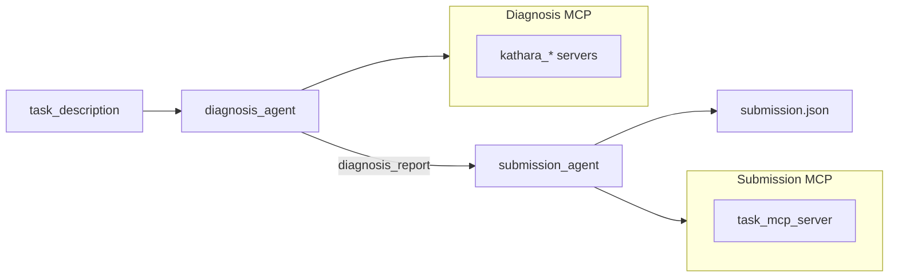

# Agent Architecture

`src/agent` hosts multiple troubleshooting agent implementations for NIKA. All implementations share the same entry contract (`protocols.TroubleshootingAgent`) and produce the same session artifacts (`messages.jsonl`, `submission.json`, etc.).

## Directory Layout

```
src/agent/
├── protocols.py          # Shared Protocol interface
├── registry.py           # Type registry and factory for `nika agent run`
├── langgraph/            # [implemented] LangGraph + LangChain workflows
│   ├── react_agent.py    # ReAct orchestration: diagnosis → submission
│   ├── plan_execute_agent.py
│   ├── reflexion_agent.py
│   ├── workflow_models.py
│   └── domain_agents/    # LangChain create_agent subgraphs
├── tool_evolution/       # Persistent mastery + validated composite tools
├── mock/                 # [implemented] Deterministic mock without an LLM
│   └── mock_agent.py
├── sdk/                  # [planned] Direct Claude / Codex SDK integration
│   └── agent.py
├── cli/                  # [implemented] LangGraph + Codex CLI
│   ├── agent.py          # CliAgent — StateGraph orchestrator
│   ├── codex_worker.py   # CodexWorker — codex exec subprocess adapter
│   ├── codex_display.py  # Terminal formatting for codex --json events
│   └── domain_agents/    # Per-phase Codex CLI workers (diagnosis / submission)
├── llm/                  # LangChain model factory for the LangGraph path
│   └── model_factory.py
└── utils/                # Shared utilities across implementations
    ├── mcp_servers.py    # Kathara / task MCP configuration
    └── loggers.py        # Structured logging to messages.jsonl
```

## Agent Implementations

| Type | CLI name | Orchestration | LLM access | Status |
|------|----------|---------------|------------|--------|
| LangGraph | `react` | LangGraph `StateGraph` | LangChain ReAct + `load_model()` | Implemented |
| LangGraph | `plan-execute` | Planner → executor → replanner | LangChain structured output + ReAct tools | Implemented |
| LangGraph | `reflexion` | Attempt → evaluator → reflect → retry | Structured evaluator/memory + ReAct tools | Implemented |
| Mock | `mock` | Hand-written two-phase flow | No LLM; fixed tool sequence | Implemented |
| SDK | `sdk` | TBD (recommended: same two phases) | Anthropic SDK / Cursor SDK | Planned |
| LangGraph + CLI | `cli` | LangGraph `StateGraph` | `codex exec` subprocess | Implemented |

## Shared Two-Phase Flow

Every implementation follows the same troubleshooting pipeline:



- **Diagnosis**: Connects to Kathara MCP servers (`if_submit=False`) to detect anomalies, localize faulty devices, and identify root causes.
- **Submission**: Connects to the task MCP server (`if_submit=True`) and calls `list_avail_problems` + `submit`.

## 1. LangGraph Path (`-a react`)

**Entry point**: `agent.langgraph.react_agent.BasicReActAgent`

- Top-level orchestration uses a LangGraph `StateGraph` with two nodes.
- Each node is a LangChain `create_agent` ReAct subgraph (`DiagnosisAgent` / `SubmissionAgent`).
- LLMs are loaded via `agent.llm.model_factory.load_model()` (openai / ollama / deepseek / netmind).
- Tracing: Langfuse + LangSmith. Logging: `AgentCallbackLogger`.

```bash
nika agent run -a react -b netmind -m openai/gpt-oss-120b -n 20
nika agent run -a react -b deepseek -m deepseek-chat -n 20
```

The NetMind backend is restricted to the verified models printed by
`nika agent list`.

## 2. Plan & Execute Path (`-a plan-execute`)

**Entry point**: `agent.langgraph.plan_execute_agent.PlanExecuteAgent`

- The planner creates a typed investigation plan.
- A tool-enabled ReAct executor completes one plan item at a time.
- The replanner either revises the remaining steps or emits the final diagnosis.
- `--max-steps` limits both each executor invocation and total executed plan items.

```bash
nika agent run -a plan-execute -b netmind -m openai/gpt-oss-120b -n 20
```

## 3. Reflexion Path (`-a reflexion`)

**Entry point**: `agent.langgraph.reflexion_agent.ReflexionAgent`

- Runs a fresh tool-enabled diagnosis attempt.
- A strict structured evaluator checks evidence, localization, root cause, and contradictions.
- Failed attempts produce compact episodic memory containing lessons and a different next strategy.
- The next attempt receives all accumulated episodic memory and performs a fresh investigation.
- Stops when the evaluator accepts an attempt or `--max-attempts` is reached.

```bash
nika agent run -a reflexion -b netmind -m openai/gpt-oss-120b -n 20 -r 3
```

## 4. Mock Path (`-a mock`)

**Entry point**: `agent.mock.mock_agent.MockAgent`

- Skips LangGraph and LangChain; calls MCP tools from a fixed script.
- Matches the `BasicReActAgent.run()` interface for CI and parallel benchmark tests.
- Writes the same `messages.jsonl` event schema as the LangGraph path.

```bash
nika agent run -a mock -n 5
```

## 5. Tool Evolution module (`--tool-evolution`)

**Integration point**: `DiagnosisAgent`, shared by ReAct, Plan-Execute, and
Reflexion. The module enriches tool descriptions, retrieval, synthesis, and
post-incident curation without owning workflow orchestration or submission.

- **DRAFT-like mastery** keeps MCP implementations immutable while versioned
  Tool Cards rewrite their model-facing preconditions, parameter guidance,
  output interpretation, and failure semantics from real execution feedback.
- **TTE-like synthesis** records a capability gap, creates an ephemeral
  declarative workflow, and requires structural, runtime, and output-contract
  verification before persistence.
- **Alita-G-like distillation** removes failed and duplicate calls, generalizes
  repeated concrete values into shared parameters, and stores successful
  workflows as reusable candidates.
- Composite tools use a stricter composable-primitive policy than the live
  diagnosis surface: they exclude file reads, traffic generators, unrestricted
  command arguments, and service/config changes.
- Libraries live under `runtime/tool_evolution/{library_id}/`.
- A source trajectory does not count as validation. Candidates require solved
  incidents in two distinct scenario/topology contexts before promotion;
  benchmark development/transfer splits are fully read-only.
- Library capacity defaults to 250 and overflow is pruned by status and
  observed utility.

```bash
nika agent run -a react -b netmind -m openai/gpt-oss-120b --tool-evolution \
  --tool-library experiment-a --evolution-mode dual
nika benchmark run --csv benchmark/tool_evolution_stream.csv \
  -a react --tool-evolution --tool-library experiment-a
```

## 6. SDK Path (`-a sdk`, planned)

**Placeholder**: `agent.sdk.agent.SdkAgent`

Design notes:

- Bypass LangChain and use Claude / Codex SDK tool-use APIs directly.
- Expose MCP tools to the model via SDK MCP configuration or an adapter.
- Keep the diagnosis → submission flow and the same logging format.

Register the `"sdk"` branch in `registry.create_agent()` once implemented.

## 7. LangGraph + CLI Path (`-a cli`)

**Entry point**: `agent.cli.agent.CliAgent`

- Mirrors the same two-node `StateGraph` structure as `BasicReActAgent` (implemented in `cli/agent.py`).
- Replaces LangChain workers with `CodexWorker` subprocess wrappers (`codex exec`).
- Each phase runs in an isolated per-session workspace under `results/{session_id}/codex_workspace/`.
- MCP servers are written to a private `CODEX_HOME` so the global `~/.codex/` config is not touched.
- `codex exec --json` events are streamed line-by-line to `messages.jsonl` and pretty-printed to the terminal.

```bash
# authenticate once
codex login

nika agent run -a cli -m gpt-5.4-mini -e medium
```

The `-b` / `--backend` flag applies to ``react``, ``plan-execute``, ``reflexion``, and ``mock``; Codex CLI always uses OpenAI models.
Use `-e` / `--reasoning-effort` to set Codex ``model_reasoning_effort`` (``none``, ``minimal``, ``low``, ``medium``, ``high``, ``xhigh``).

## Example Workflow

```bash
nika env run simple_bgp
nika failure inject link_down --set host_name=pc1 --set intf_name=eth0
nika agent run -a cli -m gpt-5.4-mini
nika session close -y
nika eval metrics
```

See the root [README.md](../../README.md#troubleshooting-agents) for a longer walkthrough including ReAct and evaluation steps.

## Adding a New Agent

1. Implement a class in the appropriate subpackage with `async def run(task_description) -> dict`.
2. Add a branch in `registry.create_agent()`.
3. Ensure `MessageLogger` (or `AgentCallbackLogger` for LangChain paths) writes to `{session_dir}/messages.jsonl`.

## CLI Usage

```bash
nika agent list                              # List agent types and LLM backends
nika agent run -a react -b openai -m ...   # ReAct baseline
nika agent run -a plan-execute -b openai -m ...
nika agent run -a reflexion -b openai -m ...
nika agent run -a react -b openai -m ... --tool-evolution \
  --tool-library experiment-a
nika agent run -a cli -m gpt-5.4-mini      # Codex CLI path
nika agent run -a mock                       # Mock path (no LLM required)
# nika agent run -a sdk                      # Not yet implemented
```

Registration and dispatch live in `nika/workflows/agent/run.py` → `agent.registry.create_agent()`.
